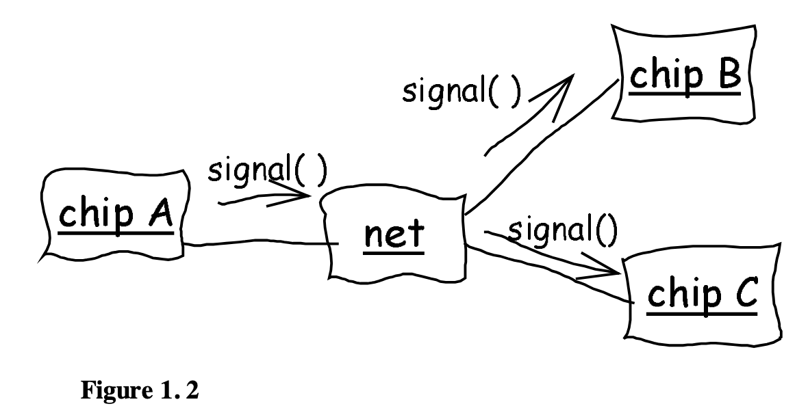
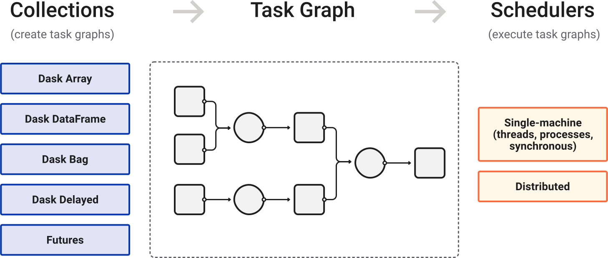
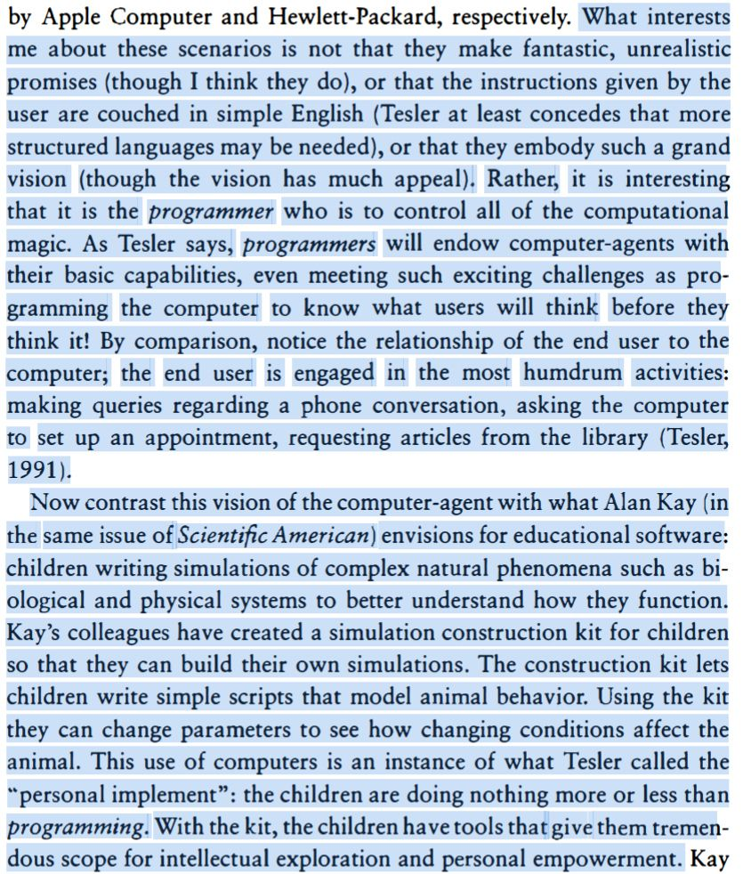

Update 2026-05-30:
I rewrote this again based on a single comment from Juan Luis Cano Rodríguez,
that I didn't explain what domain modeling was. Right, of course.

Update 2026-03-06:
I first wrote this back at the start of 2025. 
Now I've rewritten and broken this post up into two, one here and [one on the VocalPy developer's blog](https://blog.vocalpy.org/posts/2025-12-19-domain-driven-design/), 
based on feedback from folks in the [US-RSE](https://us-rse.org/) and [pyOpenSci](https://www.pyopensci.org/) communities: 
[Ben Fulton](https://fosstodon.org/@benfulton), [Hector Correa](https://hectorcorrea.com/about), 
[Kris Armeni](https://www.kristijanarmeni.net/), [Warrick Ball](https://warrickball.gitlab.io/),
and [Felipe Moreno](https://flpm.dev/).
Special thanks to [Alex Chabot-Leclerc](https://alexchabot.net/) for reading closely and talking through the earlier version.

---

In this post I hope to convince you that scientific software should 
focus on domain modeling more. 
That open sentence might make you think that you are not the intended audience 
for this blog post. So first let me tell you 
that at the end of the post I am going to argue that everyone is a scientist, 
so we should all care about how our models of the world get implemented in code. 
Or, to put that in a way you might find less ridiculous, 
I think you should read this post even if you think you don't care that much 
about scientific software. 
I am going to start out talking about 
how I am more and more surprised that scientific software 
rarely if ever talks about domain modeling, 
but I am going to end up convinced 
that what I have to say applies to software 
more generally; scientific software is just a specific case 
of a more general phenomenon.

*Domain model.* I keep using that term.
If you are a scientist, you might naturally think that 
scientific software has a lot to do with (scientific) models already. 
And if you are a *computer* scientist, 
you might similarly think that of course scientific software 
is built around domain models, 
based on your understanding of that term.
I will define domain modeling below. 
And I will argue that, if you are already familiar with that term,  
then everything you know about it, 
and related topics like object-oriented programming, is wrong. 

And I will conclude that this actually *matters*, 
that if we want computer "scientists"
and all the other scientists to work together better, 
we should make these domain models super explicit. 
And, again, I think this is true more generally  
of software developers and the downstream users 
of that software, who I think we can agree should ideally be in dialogue 
with the core developers 
(unless you are a little fascist that wants to jail users in a walled garden, 
in which case, we'll be out here when you're ready to join the human race).
There's two reasons that domain models matter. 
The first reason is fairly obvious, and probably lines up 
with your understanding of the term "domain model": 
by focusing on a domain model, 
we design software with affordances 
that most fit the task at hand. 
The second reason is less obvious, and, I hope, 
more interesting: 
domain models serve as boundary objects 
that allow broad groups of workers with loosely-aligned interests 
to collaborate. 
(I'll also define what a boundary object is below.)

Let me say right here at the top 
that I am not claiming any of these ideas are new, 
or my own. 
But I think they bear repeating.  
I will give detail and links below 
but please know 
I am stringing my thoughts together 
from several people: Eric Evans Domain-Driven Design, 
Casey Muratori's recent talk The Big OOPs,
Peter Naur's Programming as Theory Building, 
work from Susan Leigh Star, 
Bonnie Nardi's A Small Matter of Programming, 
and several recent blog posts citing those earlier writings. 
Still, I am hoping that my focus here on scientific software
has helped me synthesize these works 
in a way that is more interesting.

And when I say that I think these ideas bear repeating, 
I mean that I feel like the people who most need to hear them 
are the software engineers who seem to be all to eager 
to believe that they can be replaced with "AI", 
to relinquish that capacity that so many in Silicon Valley 
would hold up as the pinnacle of human thought: 
the ability to reason, their rationality. 
Yes, I will also end the post by relating this all to "AI", 
as is *de riguer* at the moment. 
Since that acronymn that no longer means anything, 
let me be clear that I actually mean 
"vibe-coding" with Large Language Models.
If, as Peter Naur wrote, programming is theory building, 
then we should definitely not relegate programming to Large Language Models, 
since a model of language by definition cannot conceive of a theory.
All it does is mindlessly generate code, 
no matter how much you want to believe otherwise 
because your all-too-human brain is hardwired to think that anything 
that can speak a language is as smart as you.

Last aside before I get into it: I know this is a long post. You might think I need to learn to 
[write for a short attention span](https://matthewrocklin.com/blog/work/2020/07/13/brevity). 
I have tried to write short versions of this post, 
but I feel like there's something I want to say. 
I'm making myself work through these thoughts to see if I'm making a mountain out of a molehill or not.
This is why we write, instead of asking a statistical model of language to generate a bunch of text for us. 
You might also consider the possibility that antisocial media has shortened your attention span, 
and it might be good exercise to slow down and digest some ideas. 
As a concession to our shortened attention spans, I have linked to relevant sections in the intro above.

---

Okay, with all that intro out of the way, 
let me go back to the question I started with: 
why doesn't scientific software talk about domain modeling?
If you're a scientist, my question might have you saying  
"uh, of cousre we have *models* in scientific software".
In other words, my question might not make any sense 
if I don't quickly define *domain model*. 
You're smart, you can guess what it means, 
but we have to be clear about this: 
it's a term of art in computer science and software engineering. 
You will also hear the term "domain model" used in the tech community, where programmers go around giving talks,
and where, more often than not, it can sound like shorthand for   
"all the messy real-world stuff that my code must unfortunately interact with--if only I didn't have to deal with those dang domains, 
my code would be provably correct with formal methods".

More seriously, the term implies 
an abstraction that lets programmers separate the domain from the 
low-level implementation details of actual code. 
This abstraction allows users of the software 
to go about their business in their domain, 
while programmers are free to fiddle with the low-level details, 
as long as they don't break the contract written into the domain model.  
As somebody who thinks about research software, I 
think it sure sounds like a good idea 
to make it easier for scientists to reason about a (domain) model, 
while also making it easier for research software engineers 
to develop and maintain the code that supports that model.

If you're familiar with computer science,  
you will probably have already recognized that 
domain modeling is a specific case of a 
more general phenomenon: the interface/implementation duality.
You might even be annoyed that I am missing this obvious point.
You're right; I'll say more about this below.

But let me ask my question one last time.
Why doesn't scientific software talk about domain modeling?

One answer might be, actually it does, and I am just clueless.
I would be more than happy to learn that I am wrong, 
but I have at least spent a good chunk of time interacting 
with the scientific Python ecosystem, 
and I've had a few run-ins with scientific software in other languages as well.
Yet when I first learned about the idea of domain models 
in computer science, it was news to me. 

Here's two other easy answers to my question.
The first: "Domain models? You mean like classes with methods in object-oriented programming? Don't we all do that to some extent?"
The second: "Domain models? You mean like messy business logic in CRUD apps? What does that have to do with scientific software?"

I will try to convince you that both answers miss the mark in interesting ways. 
I'll say why domain models are not just object-oriented programming (henceforth, OOP).
I'll show that, quite the opposite, OOP is instead 
a direct descendent of ideas about how to write code for scientific simulations 
(thanks in large part to a talk from Casey Muratori)-- a descendent that seems to have 
undergone some deleterious inbreeding as it made its way from academia to enterprise software.
Then I'll make the case that, actually, 
there's plenty of messiness in scientific software; 
this business of science is not all just totally abstract models 
that have been whittled down to a couple of perfect parameters with Occam's razor.
Lastly, I will make good on my promise above 
to tie this back to programming more generally, 
and why I think it seriously is still worth 
thinking about the relationship of (scientific) software and 
domain models, in spite of all the hype about vibecoding.

## What is domain modeling?

Enough preamble; finally I will define domain modeling in detail with specific examples.
Sometime in 2022-2023, I read 
[Domain-Driven Design](https://www.domainlanguage.com/ddd/) by Eric Evans, and I got really excited about it.
(From here on out I'll write "DDD" to avoid making you read "domain-driven design" a thousand times.)
If you do nothing else, read the first chapter of Evans' book, where he relates the story 
of how he worked with some electrical engineers to design software they would use to 
design printed circuit boards (AKA PCBs). 

At the beginning, he makes mistakes.
He tries to understand their jargon word-for-word.
Then he asks them to specify in detail what they think the software should do.
Neither of those approaches were ever going to work well. 
Finally he hits upon the idea of asking them to draw out diagrams of their process 
and how the software should interact with it.
These are simple, rough box and arrow sketches as he shows.



Notice what is happening here: this is not just a developer creating a UML diagram to show to other developers. 
This is software engineers and domain experts developing a pidgin language together. 
They use this pidgin to talk about the domain problem they are trying to solve with software.

It's an interesting story for a couple of reasons. First of all, you have a feeling that he is 
almost an anthropologist, going into this unfamiliar tribe of electrical engineers 
so he can learn their culture.
I think this is a familiar feeling for anyone who has tried to translate 
some real-world domain into software, even if it's part of a culture they feel like they belong to.
Second, you really get a feel for his process. 
If you have ever gone through the process of designing software for some real-world domain, 
I bet the story really resonates with you.
You should also notice here that Evans and the electrical engineers 
are co-developing a boundary object: a thing they can both refer to 
that helps them work together to achieve some task, 
in this case design a piece of software 
that helps the electrical engineers develop circuits.

Now, you might be thinking, "write code in terms of your domain, yeah, sure, everybody does that".
I got really excited reading this stuff, and told people about it at the job I had at the time.
I made a big deal of presenting parts of the book, 
and talking about how we could use this approach for what we were working on.
And I got this very underwhelmed response of 
"Yeah, we sort of already do that. Aren't you just describing object-oriented programming?"
Yes, but no! I'll come back to the "no, we aren't doing that" below, but first, the yes.
Yes, Evans is writing about object-oriented programming (henceforth, OOP), 
but the key thing is not just OOP, it's which objects to make--the design!
The important part is not the objects, but that the objects are grounded in the domain. 
We should realize that this is a design problem, and be very explicit about it!
The domain should be at the front of our mind at all times, 
so that when we iterate on the design of our software 
it is easier for domain experts to learn and use!

Now, the "but no": DDD isn't just doing OOP, but constrained by your domain. 
Yes, we all think of the domain when we write our code,
more or less subconsciously. 
But Evans advocates for a specific *development* process.
He says this process is required for his approach to design to work.
He sees it as a form of extreme or Agile programming.
If you're not familiar with those, 
the important thing to know is that they are more iterative 
than previous approaches that focused on 
"elaborate development methodologies that burden projects with useless, 
static documents and obsessive upfront planning and design", as Evans puts it.
Instead, he focuses on writing code that has a bare bones implementation 
he can test right away. "Development is iterative." 
Of course, this is one place where Python, my main programming language, shines.
It's really easy to iterate interactively in a Jupyter notebook 
with a bare-bones implementation of your sketch of an API.
Of course, later you should do some proper engineering instead of living in Jupyter notebooks, 
so you don't have to worry about someone 
giving a [preachy conference talk](https://www.youtube.com/watch?v=7jiPeIFXb6U) 
that condemns you for your naughty software development practices.

Evans' other requirement for the development process is that 
"[d]evelopers and domain experts have a close relationship."
If you are a researcher who programs, 
well, hopefully you already have a close relationship with yourself.
And with your collaborators and colleagues.
This second requirement naturally gives rise to one of the key ideas from the book, 
that of *ubiquitous language*.
This is what I called a pidgin above. It's a language that the domain experts and software developers 
arrive at together through the iterative process of development.
The words in this ubiquitous language correspond to key concepts in the domain that the software needs to capture, 
the things that developers and domain-experts realize they should focus on, as they iterate.
Ubiquitous language "embeds domain terminology in the software systems we build", 
as Martin Fowler puts it in [this post](https://martinfowler.com/bliki/DomainDrivenDesign.html). 
It's this continous process of developer and domain expert iterating together that really appeals to me.

I'll say why DDD isn't just OOP another way, paraphrasing [Alex Chabot-Leclerc](https://alexchabot.net/) 
(who gave me feedback on earlier versions of this post).
Ideally, the software developer should work backwards from the needs of the end user. 
DDD provides a process and guidelines for doing so. 
This mitigates the tendency of software developers to come up with computer-science-shaped solutions to problems. 
Those solutions make sense to them, but they are very hard for non-computer scientists to 
learn and reason about. 
A scientist cares about concepts from their domain, technical terms that 
have very nuanced meanings. 
Do not make your end user think in terms of csv files, Parquet formats, and json blobs. 
It's bad enough that I have to think so much about 
[the format of csv files](https://modelingwithdata.org/arch/00000201.htm) 
as a research software engineer; 
if at all possible I should ameliorate the need for other humans to do so. 

## Domain-driven design by example {#DDD-by-example}

If DDD is so great, why isn't everyone doing it? 
In other words, you might be wondering what some examples of DDD are. 

Let me first say I would be happy to learn that this is all 
old news to a lot of software developers. 
From my vantage point in the world of scientifc Python, 
I'm not so sure.
I can give you examples of Python APIs that I could say 
have the "feel" of what I would expect DDD to produce, 
even if the developers did not think of themselves as "doing DDD".
I can also link to my own post explaining how I am trying to use DDD 
for scientific software (below), 
comparing and contrasting that with the (mostly implicit) rules 
for scientific Python APIs.
But as far as I know, this is not a well-known idea 
(and maybe that means I shouldn't bother thinking about it so much).

To give you an example of a DDD-like Python API, 
I'm going to quote directly from a [post](https://benhoyt.com/writings/python-api-design/) 
I've linked to before, in my post about 
[structuring Python packages for scientific software](../2022-12-26-four-tips-structuring-research-python/index.qmd). 
Ostensibly, the post I'm linking to is about API design for Python. 
It compares and contrasts the API of the `requests` library 
with the `urllib` module built into the Python standard library.

> Let’s start with some code. What do you think this snippet does?
>
> ```python
> manager = urllib.request.HTTPPasswordMgrWithDefaultRealm()
> manager.add_password(None, 'https://httpbin.org/', 'usr', 'pwd')
> handler = urllib.request.HTTPBasicAuthHandler(manager)
> opener = urllib.request.build_opener(handler)
> response = opener.open('https://httpbin.org/basic-auth/usr/pwd')
> print(response.status)
> ```
> As you probably figured out, it makes an HTTP request to an httpbin.org URL with a username and password.
> 
> But is urllib.request a good API?
> 
> No, it’s terrible! You have to learn about “managers” and “handlers” and “openers”. There are two ultra-long names, HTTPPasswordMgrWithDefaultRealm (what a mouthful!) and HTTPBasicAuthHandler.
> 
> This kind of code is why the Requests library was born, back in 2011. In fact, if you’ve looked at the Requests documentation, you probably know that this example is taken from the comparison linked at the top of their docs (updated based on an official how-to).
> 
> Here’s how you’d make that same HTTP call with the Requests API:
> 
> ```python
> response = requests.get('https://httpbin.org/basic-auth/usr/pwd',
>                         auth=('usr', 'pwd'))
> print(response.status_code)
> ```
> Now that’s a nice API.

From a DDD point of view, the important thing here is that the `requests` API 
is designed at the level of detail that someone working with HTTP requests 
is thinking about. They make a request, they get back a response. 
(Thank you again to Alex Chabot-Leclerc, this time for suggesting `requests` as an example.)

Wait; is email a domain? Isn't it just a weird sub-field of computer science, 
kind of like how cooking and baking could be considered sub-fields of organic chemistry?
Yes, you're right. I'm telling you that you should think about DDD more, 
but I can't give you many good examples of it. 
The other example Alex suggested to me was `beautifulsoup`, 
and I agree that package has a user-centric API, 
but now we've moved from email to another weird branch on the family tree of computer science: 
HTML and XML.
The best example I have is [my own blog post](https://blog.vocalpy.org/posts/2025-12-19-domain-driven-design/) 
on how I'm using DDD as I develop VocalPy. 
The second best example I could think of in scientific Python was [`geopandas`](https://geopandas.org/en/stable/). 
What I like about `geopandas` is that it has the feel of a library 
designed by a domain expert, adding a bunch of methods to the `pandas.DataFrame` 
that make sense to someone working with geospatial data. 
Generally, I think a lot of [pyOpenSci packages](https://www.pyopensci.org/python-packages.html) 
could be seen through a DDD lens. 
But I'm pretty sure most developers don't think of themselves as "doing DDD". 
In earlier versions of this post, I had a mini-rant about, 
if you feel like everybody already does DDD, then show me the proof! 
Put the DDD-style diagrams in your docs, 
let me see how the design evolved! 
Literally I was advocating that researchers writing scientific software 
include DDD-style diagrams in their docs, 
that specifically illustrate changes over time. 
Okay, maybe adding an illustrated history of your API to your docs won't help users much. 
But I *do* think it would be really interesting, 
if you care about the design of scientific software, 
to look at a big dataset of how design docs change across time for multiple projects. 
This would be one way to see 
if we can make better sense of scientific software design 
through a DDD framework.

One last thing I want to say here is that 
https://nrposner.com/blog/affordances-in-library-api-design/

## Object-oriented programming as a mutant descendent of domain modeling

Ok, so in the introduction I said 
that domain models in software engineering 
are, arguably, 
just one more case of the distinction between 
interface and implementation that we see 
everywhere in computer science. 
If you read [Elements of Computer Science], 
you will be told that this distinction exists 
even at the lowest level of simple logic gates, 
where an And gate has the "interface" 
of the truth table you might have seen in a 
Philosophy 101 course, 
but its implementation could be Nand gates 
or Nor gates, or something else entirely.
Bjorne Stroustrop thought this distinction was 
so important that he hard-coded it into C++, 
with the `public` and `private` keywords, 
and its one of the first things he tells us in his PPP book.

I also said above that I have gotten the reaction, "domain-driven design? Isn't that just object-oriented programming?" 
(henceforth, OOP).
This is why I mention Stroustrop; you will of course know that his development of C++ began life as "C with classes", 
and he is one of the reasons that OOP ruled the software engineering world for roughly thirty-five years.

This is the part of the post where I tell you that everything you know about object-oriented programming is wrong. 

Actually, I will let Casey Muratori tell you, since that is (one of) the point(s) of his excellent talk.

<iframe width="560" height="315" src="https://www.youtube.com/embed/wo84LFzx5nI?si=nDWjPBE5rJN61tiE" title="YouTube video player" frameborder="0" allow="accelerometer; autoplay; clipboard-write; encrypted-media; gyroscope; picture-in-picture; web-share" referrerpolicy="strict-origin-when-cross-origin" allowfullscreen></iframe>

One big takeaway for me, given everything I've discussed above, 
is that OOP is actually a sort of mutant cousin of domain modeling. 
It's what happened when the good ideas behind OOP got corrupted 
by a game of telephone running from academics doing research 
to software engineers developing "enterprise" software for large businesses. 


You should watch the whole thing,
but I want to summarize some key points

But we can go beyond this and say, 
from the beginning, computers were developed in large part by scientists and researchers in academia.
We have to remember, there was no computer science yet, 
so the men and women who developed computer circuits and programming languages 
brought together a wildly diverse background, 
creating a "primordial soup" of ideas 
that the von Neumann architecture emerged from, 
as the authors of [Dive into Systems](https://diveintosystems.org/book/C5-Arch/hist.html) put it.
Of course some of the first things these scientists did was implement models from their scientific domains in software.

Just to really underscore the idea 
that domain modeling has been around long before object-oriented programming,
let me quote one more book, 
[Structure and Interpretation of Computer Programs](https://sourceacademy.org/sicpjs), AKA, SICP.
If you have ever tried to [teach yourself computer science](https://teachyourselfcs.com/), 
you will be familiar with SICP, and in particular that it uses the [Scheme dialect of Lisp](https://norvig.com/lispy.html).
[Wikipedia](https://en.wikipedia.org/wiki/Lisp_(programming_language)) tells us that 
Lisp "is the second-oldest high-level programming language still in common use", so, 
no, it doesn't have objects per se, although of course 
people have defined them

So, from chapter 3 of SICP:

> One powerful design strategy, which is particularly appropriate to the construction of programs 
for modeling physical systems, is to base the structure of our programs on the structure of the system being modeled. 
For each object in the system, we construct a corresponding computational object. For each system action, 
we define a symbolic operation in our computational model. 
Our hope in using this strategy is that extending the model to accommodate new objects or new actions 
will require no strategic changes to the program, only the addition 
of the new symbolic analogs of those objects or actions. 
If we have been successful in our system organization, 
then to add a new feature or debug an old one we will have to work on only a localized part of the system.


Likewise, domain modeling is not a new idea 
(as Evans himself acknowledges right at the start of his book), 
I now know for sure they've been around longer than Eric Evans' book,
because I have been attempting to read yet another book, 

I ended up finding DDD in SICP, 
and having to admit to myself that, yeah, this idea has been around forever.
When I got to chapters 2 and 3, 
there I saw that we were talking about data abstraction 
and designing programs for modeling. Sound familiar?

Well there it is.


## Domain models as boundary objects


Not to belabor the point, but I'll stick in a couple more examples of architecture diagrams 
from docs that I have noticed since I've been revisiting this idea. 
Two things I want to say here: the first being that, while it's good that these diagrams exist, you often have to dig to find them. 
So, again, I'm not saying I have a revolutionary idea; I'm just wondering if we could surface this stuff a little more. 

Here for example is a diagram from the "internals" section of the  `dask`  docs on [scheduling](https://docs.dask.org/en/stable/scheduling.html), 
illustrating the two types of schedulers:



And here is a diagram from the "architecture" section of the `mlflow` docs, 
illustrating [common setups](https://mlflow.org/docs/latest/self-hosting/architecture/overview/#common-setups):


The second thing I want to say here is: I think you can see these diagrams differently. 
They show software engineers doing domain-driven design. 
At the risk of sounding like I'm preaching that "everything is domain-driven design", 
I'll say that this looks to me now like software engineers designing for a domain using an ubiquitous language, 
one spoken by the other engineers they work with, and the engineers that use their libraries.
They speak in terms of "abstractions" and "architectures". 
(This is me returning to the point above about software engineering being a domain.)


## Domain modeling and spec-driven development

Ok, so, first off, believe me, I'm well aware that there's no shortage of thoughtfluencers 
opining about coding LLMs.

But since I rewrote and shared my post about 
[domain-driven design DDD](../2026-03-12-DDD-and-LLMs/index.qmd),
I have to say a little bit about 
how domain-driven design relates the use of Large Language Models (LLMs) for coding.

I have to say that thinking about DDD has also got me seeing overlap 
with ideas like [programming as theory building](https://cekrem.github.io/posts/programming-as-theory-building-naur/) 
and [domain-specific languages](https://mitpress.mit.edu/9780262140539/a-small-matter-of-programming/).
They conceive of software as artifacts of human culture, 
designed for a domain and built according to a theory 
because that's what *humans* do.
To me, these ideas put the lie to the notion that Large Language Model-driven development will end 
software engineering as we know it anytime soon. 
A coding LLM is just a statistical model of (programming) languages, 
"auto-complete on steroids". 
LLMs can't think, they can't theorize, 
no matter how many names you steal from cognitive science to give to the underlying math. 
Yes, as a (lapsed) cognitive scientist, I think ["chain of thought reasoning"](https://machinelearning.apple.com/research/illusion-of-thinking) 
is an offensive name for what is essentially Viterbi decoding with delusions of grandeur. 

One major point of the "Theory Building" post, and the papers it's referencing, is that source code alone 
doesn't matter as much as the domain expertise that has built up around the code. 
I choose the term "domain expertise" to link it back to DDD, 
but as a computational scientist I think we can literally describe programming as (part of!) theory building. 
Depending on your perspective, you could also call it institutional knowledge, culture, and history. 
You know, all the things that many software engineers seem to think 
they can replace with a coding LLM, i.e., autocomplete on steroids. 
Instead, it's becoming more and more obvious that 
yet another externalized cost of relying on coding LLMs will be the 
[cognitive debt](https://www.rockoder.com/beyondthecode/cognitive-debt-when-velocity-exceeds-comprehension/) 
we incur by YOLOing hundreds of lines of code from a fancy text generator 
just because it [feels good, man](https://www.fast.ai/posts/2026-01-28-dark-flow/).

Sure, but coding LLMs allow end users to formulate
And end users still need a way to formulate their ideas, including those that don't want to have to think too much about computer science, 
they .
These notes from Jamie sum up why doing that via an LLM using natural language "prompts" is a bad idea:
https://www.scattered-thoughts.net/notes/a-small-matter-of-programming/

> In natural language interfaces, users have to learn the undocumented subset of their natural language 
> that the machine understands correctly

See this quote from the introduction to "A Small Matter of Programming" 
(the book I just linked to, that considers task-specific languages, among other things): 

{fig-alt="Screenshot of text from introduction. What interests me about these scenarios is not that they make fantastic, unrealistic promises (though I think they do), or that the instructions given by the user are couched in simple English (Tesler at least concedes that more structured languages may be needed), or that they embody such a grand vision (though the vision has much appeal). Rather, it is interesting that it is the programmer who is to control all of the computational magic. As Tesler says, programmers will endow computer-agents with their basic capabilities, even meeting such exciting challenges as programming the computer to know what users will think before they think it! By comparison, notice the relationship of the end user to the computer; the end user is engaged in the most humdrum activities: making queries regarding a phone conversation, asking the computer to set up an appointment, requesting articles from the library (Tesler, 1991). Now contrast this vision of the computer-agent with what Alan Kay (in the same issue of Scientific American) envisions for educational software: children writing simulations of complex natural phenomena such as biological and physical systems to better understand how they function. Kay's colleagues have created a simulation construction kit for children so that they can build their own simulations. The construction kit lets children write simple scripts that model animal behavior. Using the kit they can change parameters to see how changing conditions affect the animal. This use of computers is an instance of what Tesler called the personal implement: the children are doing nothing more or less than programming. With the kit, the children have tools that give them tremendous scope for intellectual exploration and personal empowerment."}

(Thank you to [Alistair Davidson](https://bellacaledonia.org.uk/contributor/alistair-davidson/) 
who I saw post about this book [on Bluesky](https://bsky.app/profile/moh-kohn.bsky.social/post/3m5ia4x543s2s), 
I'm recycling their screenshot and alt text.)


These ideas present an alternative to magical, god-like AI "agents" that do all the intellectual heavy lifting for 
software developers, and anyone else who does any kind of creative thinking for a living. 
But I'll save those thoughts for yet another blog post.